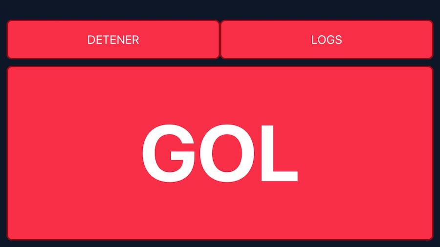

### Saving our best moments in amateur sports 
 
Our first try would be bringing a GoPro Cam to a soccer match with friends. However it involves **too much work** to do it frequently.

You have to download a full-length video of the match to your computer and search thought it for highlights. 

It would be awesome to have all the hightlights on my phone right after the match.

**What if we press a button every time something interesting happens and save the last 15 seconds of action?**


### Not entirely a new idea

Some amateur leagues are doing it and it's awesome:

<Embed
  src="https://www.youtube.com/embed/ShQQIwEjPBM"
/>

We will build our button app and connect it with a GoPro Cam by writing some React Native code.  

### Learn about GoPro capabilities 

I started by experimenting with my GoPro Cam, a Silver Hero 3. It has a Wifi Spot which you can send commands over curl (see all commands for this or other models on this [repo](https://github.com/KonradIT/goprowifihack
                                                                                                                                                               )). 
For example:
```
# SWITCH TO VIDEO MODE
curl "http://10.5.5.9/camera/CM?t=$GOPROPASS&p=%00"

# START/STOP RECORDING 
curl "http://10.5.5.9/bacpac/SH?t=$GOPROPASS&p=%01"

# DELETE ALL FILES FROM CAMERA
curl "http://10.5.5.9/camera/DA?t=$GOPROPASS"

```

Also it has a file server (Cherokee) where you can see all cam files:
```
# See files on your browser
open "http://10.5.5.9:8080/gp/gpMediaList"
```

Finally, if you have stuff like VLC or ffmpeg on your mac, we can do some magic:

```
# ENABLE STREAMING AND SEE LIVE VIDEO FROM VLC
curl -i "http://10.5.5.9/camera/PV?t=$GOPROPASS&p=%02"
vlc "http://10.5.5.9:8080/live/amba.m3u8"
# DOWNLOAD LAST 15 SECONDS OF SOME VIDEO ON YOUR GOPRO
ffmpeg -sseof -15 -i "$VIDEO_URL" -c copy output.mp4
```

So far I gave you every terminal command to build the app. Although we would like to have a mobile app to run those commands and not a computer.

### Button Mobile App

To build the app, I chose React Native because it's really simple to use and we could use fetch API to execute most of the previous commands. 

The only command which isn't available from mobile is the one to get only the last 15 seconds of the current video because it depends on ffmpeg. I use an open source library called [react-native-video-processing](https://github.com/santiagovazquez/react-native-video-processing) and made changes on top of it (to be able to trim network files).

You can see the whole code of my mobile app on [Github](https://github.com/santiagovazquez/GoProGoals).



I gave a lighting talk of this project on MeetupJS. See slides [here](https://santiagovazquez.github.io/gopro_lighting_talk/) (in Spanish). Also some recording examples are uploaded to my [YouTube Account](https://www.youtube.com/watch?v=lmBAo_DPbUE&list=PLE8Be1z3NnYjlIO-RfyEWX96b0Cmx0zLE).
